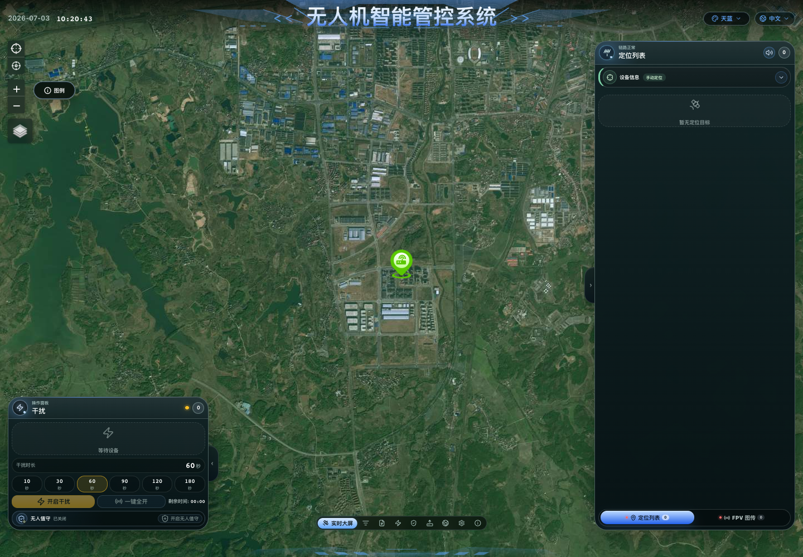
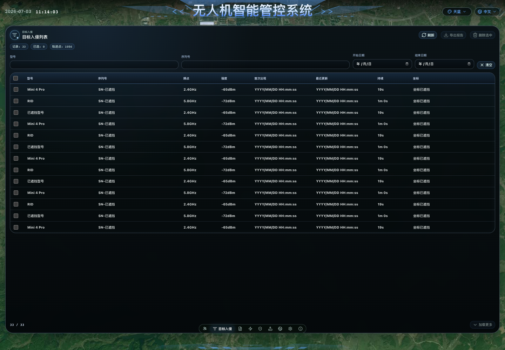
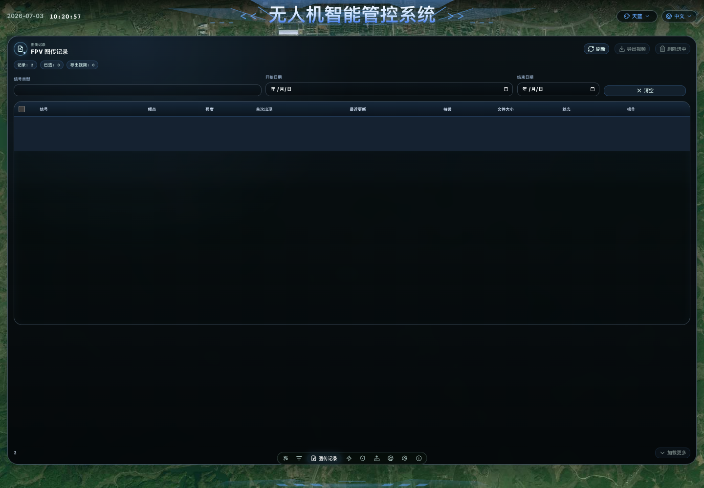
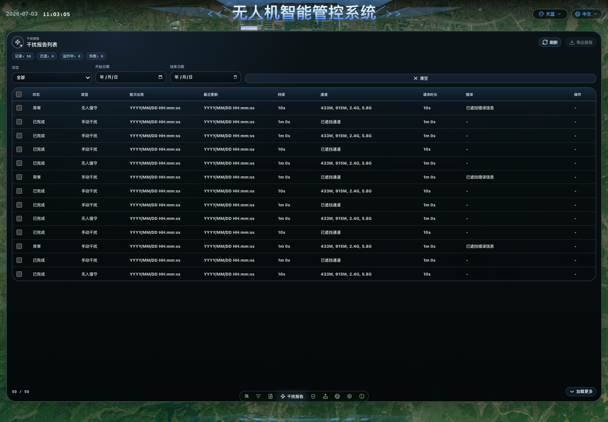
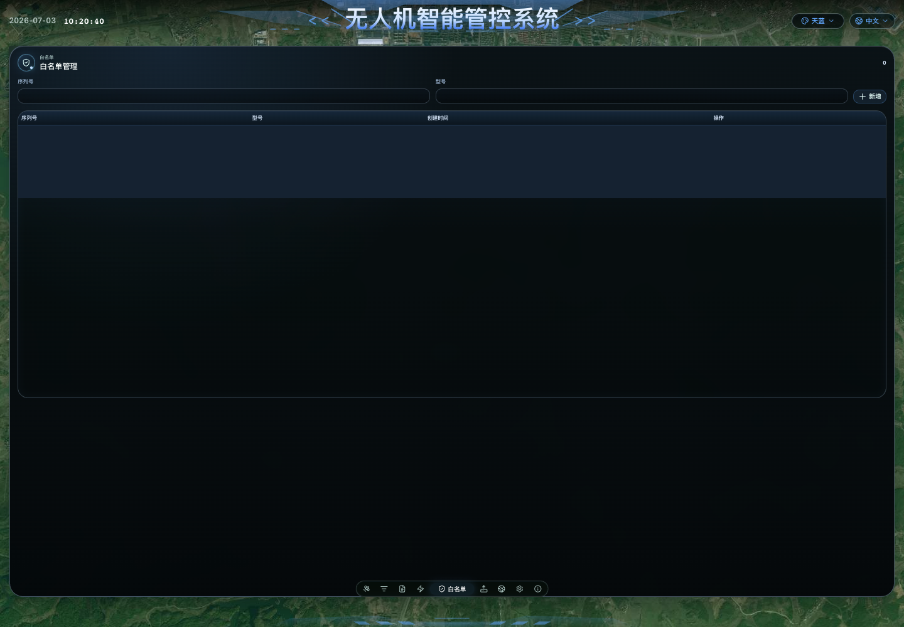
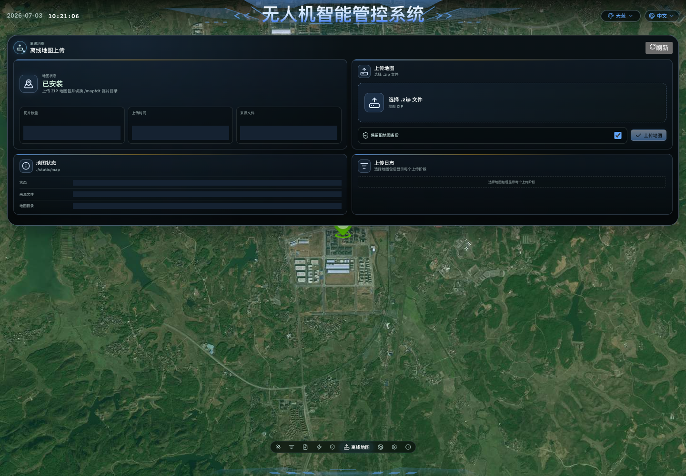
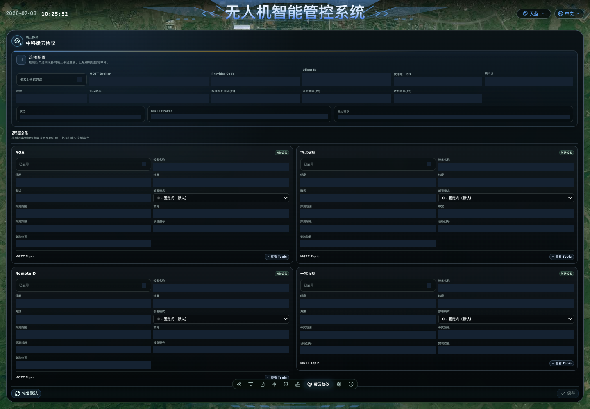
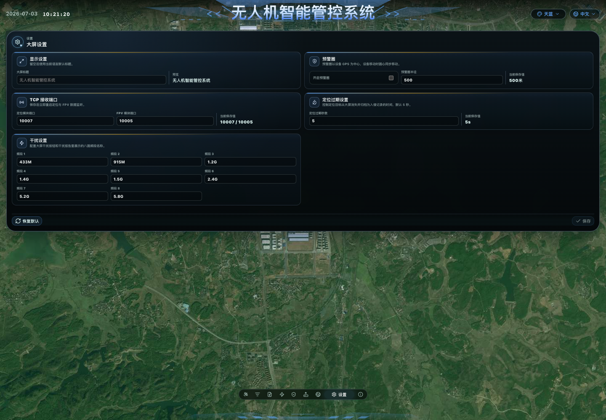
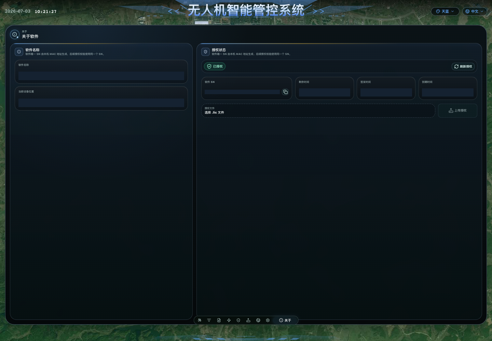

# 无人机智能管控系统用户操作手册

## 1. 文档说明

本文档面向系统操作员、值守人员和现场维护人员，说明如何通过浏览器使用“无人机智能管控系统”完成实时监测、目标处置、记录查询、白名单管理、离线地图上传、授权维护和系统配置。

本文档配套截图保存在 `docs/images/user-manual/`。截图来自当前本地运行页面，涉及历史记录、设备身份、授权 SN、Broker、账号、密码、位置坐标等运行环境信息的位置已做遮挡处理，实际使用时以现场页面显示为准。

系统默认访问地址为：

```text
http://localhost:18080/
```

如部署在其他主机上，请将 `localhost` 替换为服务器 IP 地址，例如：

```text
http://192.168.100.101:18080/
```

## 2. 系统用途

本系统用于接收和展示无人机相关网口数据，主要包含：

- 定位数据接收：默认 TCP 端口 `10007`。
- FPV 图传告警数据接收：默认 TCP 端口 `10005`。
- 实时地图显示：展示无人机、飞手、返航点、设备位置和轨迹。
- 干扰控制：支持手动选择通道干扰、一键全开和无人值守干扰。
- 数据管理：支持目标入侵记录、FPV 图传记录、干扰报告查询、导出和删除。
- 白名单管理：对可信目标进行放行标记，降低值守告警干扰。
- 离线地图：支持上传 ZIP 地图包并在地图图层中使用。
- 授权管理：支持查看软件 SN、上传 `.lic` 授权文件。

## 3. 使用前准备

### 3.1 网络与设备连接

1. 确认部署电脑与探测设备、FPV 设备、干扰设备处于可通信网络。
2. 设备端 TCP 目标地址应配置为部署电脑网口 IP。项目默认目标地址为 `192.168.100.101`。
3. 定位模块默认向 `10007` 端口发送数据。
4. FPV 模块默认向 `10005` 端口发送数据。
5. 干扰设备默认通过网络继电器连接，连接状态会显示在实时大屏左侧干扰面板中。

### 3.2 浏览器访问

1. 打开浏览器。
2. 输入系统地址 `http://localhost:18080/`。
3. 页面标题显示“无人机智能管控系统”后，即可开始使用。

### 3.3 授权检查

大部分业务接口需要有效授权。首次使用或授权异常时：

1. 点击顶部或侧边菜单中的“关于”。
2. 查看“授权状态”。
3. 如显示“未授权”，先复制“软件 SN”，提供给授权签发人员。
4. 获取 `.lic` 授权文件后，点击“选择 .lic 文件”。
5. 点击“上传授权”。
6. 点击“刷新授权”，确认状态显示为“已授权”。

常见授权异常：

- 未找到授权文件：当前系统没有可用授权文件。
- 授权已过期：需要重新签发授权。
- 授权文件与当前软件 SN 不匹配：授权文件不是为当前设备生成。
- 授权签名无效或授权文件无效：请重新获取授权文件。

## 4. 页面导航

系统主要页面如下：

| 页面 | 用途 |
| --- | --- |
| 实时大屏 | 查看实时定位、FPV 信号、地图、设备状态和干扰操作 |
| 目标入侵 | 查询、筛选、导出、删除已归档的入侵记录 |
| 图传记录 | 查询、播放、导出、删除 FPV 录制视频 |
| 干扰报告 | 查看手动干扰和无人值守干扰记录 |
| 白名单 | 新增、编辑、删除可信目标序列号 |
| 离线地图 | 查看离线地图状态，上传地图 ZIP 包 |
| 凌云协议 | 配置中移凌云 MQTT 上报和逻辑设备信息 |
| 设置 | 配置大屏标题、预警圈、TCP 端口、定位过期、干扰通道标签 |
| 关于 | 查看软件信息、设备位置、软件 SN 和授权状态 |

顶部右侧支持切换语言和主题颜色。

### 4.1 界面截图索引

| 图号 | 页面 | 图片 |
| --- | --- | --- |
| 图 1 | 实时大屏 | `docs/images/user-manual/01-realtime-screen.png` |
| 图 2 | 目标入侵 | `docs/images/user-manual/02-intrusions.png` |
| 图 3 | 图传记录 | `docs/images/user-manual/03-fpv-records.png` |
| 图 4 | 干扰报告 | `docs/images/user-manual/04-interference-reports.png` |
| 图 5 | 白名单 | `docs/images/user-manual/05-whitelist.png` |
| 图 6 | 离线地图 | `docs/images/user-manual/06-offline-map.png` |
| 图 7 | 凌云协议 | `docs/images/user-manual/07-lingyun.png` |
| 图 8 | 设置 | `docs/images/user-manual/08-settings.png` |
| 图 9 | 关于与授权 | `docs/images/user-manual/09-about-license.png` |

## 5. 实时大屏操作



图 1 展示实时大屏页面。左侧为干扰操作面板，中间为地图区域，右侧为定位列表和 FPV 图传列表，底部为页面导航。

### 5.1 查看系统状态

进入“实时大屏”后，重点查看以下区域：

- 地图区域：显示设备位置、无人机、飞手、返航点、轨迹和预警圈。
- 右侧信息面板：显示“定位列表”和“FPV 图传”两个页签。
- 左侧干扰面板：显示干扰设备连接状态、通道选择和干扰按钮。
- 顶部状态：显示当前日期、时间、系统标题、语言和主题。

定位 TCP 或 FPV TCP 状态一般有三种含义：

- 已连接：有设备连接并正在发送数据。
- 监听中：服务端口已打开，等待设备连接。
- 未监听：端口未正常打开，需要检查端口配置或服务状态。

### 5.2 查看定位目标

1. 在右侧信息面板选择“定位列表”。
2. 目标卡片会显示型号、序列号、频点、RSSI、飞手距离、无人机距离、高度、海拔、速度、首次出现和最近更新时间。
3. 点击目标卡片，地图会选中该目标并显示对应位置和轨迹。
4. 如目标正在解析加密 DJI O3/O4 信息，会显示“解析中”，部分操作会暂时不可用。
5. 目标超过“定位过期秒数”未更新后，会从实时列表消失并归档为“目标入侵”记录。

### 5.3 使用地图

地图可展示：

- 设备位置。
- 无人机位置。
- 飞手位置。
- 返航点。
- 无人机轨迹。
- 飞手轨迹。
- 预警圈。
- 白名单和未入白名单目标的不同图标。

常用操作：

1. 拖动地图查看周边区域。
2. 使用缩放控件放大或缩小。
3. 使用地图图层控件切换标准地图、卫星图或离线地图。
4. 点击目标或右侧目标卡片联动选中目标。
5. 如坐标旁显示“导航二维码”按钮，可生成高德地图和 Google 地图导航二维码。

### 5.4 设置设备位置

设备位置可来自设备 GPS，也可手动设置。

手动输入：

1. 在右侧“设备信息”中点击展开。
2. 点击“设置手动定位”或“修改手动定位”。
3. 输入纬度和经度。
4. 点击“保存”。

地图点选：

1. 在“设备信息”中点击“点选手动定位”。
2. 在地图上点击目标位置。
3. 系统会将该点作为设备位置。
4. 再次点击“取消点选”可退出点选模式。

清除手动定位：

1. 打开手动定位弹窗。
2. 点击“清除”。
3. 系统会恢复使用设备上报的位置。

### 5.5 白名单快速操作

实时目标卡片中可直接加入或移出白名单。

1. 在“定位列表”找到目标。
2. 点击“加入白名单”。
3. 加入后目标会显示“已在白名单”，并不再作为未入白名单告警目标。
4. 如需恢复告警，点击“移出白名单”。

注意：没有序列号的目标无法加入白名单；仍在解析中的加密目标需要等待解析完成。

### 5.6 声音报警

系统会统计未入白名单的告警目标数量。

1. 点击右侧面板顶部的声音按钮可开启或静音声音报警。
2. 如浏览器阻止自动播放，页面会提示“浏览器已阻止自动播放，请点击启用声音告警”。
3. 按提示点击启用后，后续告警可播放声音。

### 5.7 查看 FPV 图传信号

1. 在右侧信息面板选择“FPV 图传”。
2. 列表显示信号类型、频点、RSSI、最近更新时间和“查看视频”按钮。
3. 点击“查看视频”可打开 FPV 视频流。
4. 如果显示“未配置视频”，说明后台未配置可播放的视频流。
5. 如果显示“已有客户端正在查看视频”，说明当前只允许一个客户端查看视频。

### 5.8 干扰操作

左侧“干扰”面板用于控制干扰输出。

手动干扰：

1. 选择一个或多个干扰通道。
2. 选择干扰时长。系统支持预设时长，时长范围为 10 秒到 3 分钟。
3. 点击“开启干扰”。
4. 干扰中会显示剩余时间。
5. 如需提前停止，点击“停止干扰”。

一键全开：

1. 确认干扰时长。
2. 点击“一键全开”。
3. 系统会对所有非保留通道开启干扰。

无人值守：

1. 选择需要自动使用的干扰通道。
2. 选择干扰时长。
3. 点击“开启无人值守”。
4. 系统进入自动模式，状态可能显示“等待目标”“自动干扰中”或“休息中”。
5. 需要退出时点击“关闭无人值守”。

注意事项：

- 干扰设备未连接时，操作可能失败。
- 手动干扰和无人值守模式互斥。
- 干扰中通道和时长不可随意修改，需要先停止当前操作。

## 6. 目标入侵记录



图 2 展示目标入侵列表页面。页面支持按型号、序列号和日期筛选，并提供刷新、导出报告和删除选中记录等操作。

“目标入侵”页面用于查看已归档的定位目标。

### 6.1 查询和筛选

可按以下条件筛选：

- 型号。
- 序列号。
- 开始日期。
- 结束日期。

操作步骤：

1. 点击“目标入侵”。
2. 输入筛选条件。
3. 列表会自动按条件刷新。
4. 点击“清空”可移除筛选条件。
5. 点击“加载更多”查看更多历史记录。

### 6.2 查看记录内容

记录表格包含：

- 型号。
- 序列号。
- 频点。
- RSSI。
- 首次出现。
- 最近更新。
- 持续时间。
- 坐标。
- 轨迹回放。
- 飞手距离。
- 无人机距离。
- 速度。
- 高度。

如记录包含轨迹数据，可点击“轨迹回放”打开入侵坐标地图。

### 6.3 导出入侵报告

1. 勾选需要导出的记录。
2. 点击“导出报告”。
3. 系统会下载 CSV 文件。
4. 如记录包含轨迹点，会额外导出轨迹点 CSV 文件。

### 6.4 删除入侵记录

1. 勾选需要删除的记录。
2. 点击“删除选中”。
3. 在确认弹窗中点击“删除”。

删除后无法恢复，请谨慎操作。

### 6.5 从入侵记录维护白名单

1. 在记录列表的序列号列点击“加入”。
2. 目标序列号会写入白名单。
3. 已在白名单的记录可点击“移出”。

## 7. 图传记录



图 3 展示图传记录页面。页面支持按信号类型和日期筛选，记录可播放、导出或删除。

“图传记录”页面用于管理 FPV 录制文件。

### 7.1 查询图传记录

可按以下条件筛选：

- 信号类型。
- 开始日期。
- 结束日期。

点击“清空”可恢复默认列表，点击“加载更多”查看后续记录。

### 7.2 播放视频文件

1. 找到状态为“可播放”的记录。
2. 点击操作列中的“播放”。
3. 系统会打开视频播放弹窗。
4. 可使用浏览器视频控件播放、暂停、拖动进度或全屏。

如记录状态为“失败”，点击“查看”可查看失败原因。

### 7.3 导出视频文件

1. 勾选需要导出的视频记录。
2. 只有状态为“可播放”且存在文件地址的记录可导出。
3. 点击“导出视频”。
4. 系统会下载视频压缩包。

### 7.4 删除图传记录

1. 勾选需要删除的记录。
2. 点击“删除选中”。
3. 在确认弹窗中点击“删除”。

删除操作会删除记录及对应视频文件，无法恢复。

## 8. 干扰报告



图 4 展示干扰报告页面。页面用于查看手动干扰和无人值守干扰的执行记录，并支持按状态和日期筛选。

“干扰报告”页面用于查看干扰操作历史。

### 8.1 筛选报告

可按状态筛选：

- 全部。
- 运行中。
- 已完成。
- 失败。
- 异常。

同时可按开始日期和结束日期筛选。

### 8.2 查看报告内容

报告列表包含：

- 状态。
- 类型：手动干扰或无人值守。
- 开始时间。
- 结束时间。
- 实际持续时间。
- 干扰通道。
- 请求时长。
- 错误或异常原因。

### 8.3 删除失败报告

只有状态为“失败”的报告提供删除按钮。

1. 在失败报告行点击“删除”。
2. 在确认弹窗中点击“删除”。

删除后无法恢复。

## 9. 白名单管理



图 5 展示白名单管理页面。操作员可在此新增、编辑或删除可信目标序列号。

白名单用于标记可信无人机目标。白名单目标在实时大屏中不会作为未入白名单告警目标。

### 9.1 新增白名单

1. 点击“白名单”。
2. 在“序列号”输入目标序列号。
3. 在“型号”输入目标型号，可留空。
4. 点击“新增”。

### 9.2 编辑白名单

1. 在白名单列表中点击“编辑”。
2. 修改序列号或型号。
3. 点击“保存”。
4. 如不保存，点击“取消”。

### 9.3 删除白名单

1. 在白名单列表中点击“删除”。
2. 删除后该目标再次出现时会按普通目标告警。

## 10. 离线地图



图 6 展示离线地图页面。页面包含地图安装状态、瓦片数量、上传入口和上传日志。

“离线地图”页面用于上传和查看本地瓦片地图。

### 10.1 查看地图状态

页面会显示：

- 地图状态：已安装或未安装。
- 瓦片数量。
- 上传时间。
- 来源文件。
- 地图目录。

点击“刷新”可重新读取当前地图状态。

### 10.2 上传离线地图

1. 准备 `.zip` 格式地图包。
2. 点击“选择 .zip 文件”。
3. 如需保留旧地图，勾选“保留旧地图备份”。
4. 点击“上传地图”。
5. 等待上传进度和后端处理日志完成。
6. 显示“离线地图上传完成”后，可在地图图层中切换到离线地图。

限制说明：

- 只支持 `.zip` 文件。
- 默认上传大小上限为 2048 MB。
- 上传过程中不要刷新页面或关闭浏览器。

## 11. 凌云协议配置



图 7 展示凌云协议配置页面。截图中的 Broker、Provider Code、账号、设备身份和位置等运行环境信息已遮挡。

“凌云协议”页面用于配置中移凌云平台 MQTT 上报。

### 11.1 连接配置

可配置：

- 是否开启凌云上报。
- MQTT Broker。
- Provider Code。
- 用户名。
- 密码。
- 数据发布间隔。
- 注册间隔。
- 状态间隔。

页面会显示：

- Client ID。
- 软件唯一 SN。
- 协议版本。
- 当前连接状态。
- 最近错误。

开启凌云协议时，必须填写 Broker、Provider Code，并确保软件 SN 可用。

### 11.2 逻辑设备配置

系统内置四类逻辑设备：

- AOA。
- 协议破解。
- RemoteID。
- 干扰设备。

每类设备可配置：

- 是否启用。
- 设备名称。
- 海拔。
- 部署模式：固定式或移动式。
- 探测范围或干扰范围。
- 带宽。
- 探测频段或干扰频段。
- 设备型号。
- 安装位置。

经纬度通常来自当前设备位置，页面中以只读方式展示。

### 11.3 查看 MQTT Topic

1. 在对应逻辑设备卡片中点击“查看 Topic”。
2. 系统会展示注册发布、状态发布、数据发布、控制订阅和控制响应 Topic。
3. 点击“收起 Topic”可关闭展示。

### 11.4 保存或恢复默认

- 点击“保存”提交当前配置。
- 点击“恢复默认”恢复系统默认凌云配置，再按需保存。

## 12. 系统设置



图 8 展示系统设置页面。页面包含大屏标题、预警圈、TCP 接收端口、定位过期秒数和干扰频段标签配置。

“设置”页面用于调整大屏展示和接收参数。

### 12.1 显示设置

1. 在“大屏标题”中输入自定义标题，最多 32 个字符。
2. 右侧“预览”会显示保存后的标题。
3. 留空时使用当前语言默认标题。

### 12.2 预警圈

预警圈以设备 GPS 为中心，设备移动时圆心同步移动。

1. 开启或关闭预警圈。
2. 设置预警圈半径。
3. 半径范围为 10 到 50000 米。
4. 保存后，地图显示和告警判断会按新配置生效。

当开启预警圈时，未入白名单目标进入预警圈才会作为告警目标；未获取有效设备位置时，预警圈不会显示。

### 12.3 TCP 接收端口

可配置：

- 定位模块端口。
- FPV 模块端口。

规则：

- 端口范围为 1 到 65535。
- 两个端口不能相同。
- 保存后会立即重启定位与 FPV 数据监听。

修改端口后，需要同步修改设备端发送目标端口。

### 12.4 定位过期秒数

用于控制定位目标从实时大屏消失并归档为入侵记录的时间。

- 默认值：5 秒。
- 可设置范围：1 到 3600 秒。

设置过短会导致目标频繁归档；设置过长会使已离开的目标继续停留在大屏。

### 12.5 干扰频段标签

可配置 8 路干扰通道在大屏和干扰报告中的显示名称。

默认标签为：

```text
433M, 915M, 1.2G, 1.4G, 1.5G, 2.4G, 5.2G, 5.8G
```

修改后点击“保存”生效。

### 12.6 恢复默认和保存

- 点击“恢复默认”会将标题、定位过期、预警圈和干扰通道标签恢复为默认值。
- 点击“保存”提交修改。
- 未修改或校验未通过时，“保存”按钮不可用或会显示错误提示。

## 13. 关于与授权



图 9 展示关于与授权页面。截图中的软件 SN、授权时间和设备位置等运行环境信息已遮挡。

“关于”页面包含：

- 软件名称。
- 当前设备位置。
- 授权状态。
- 软件 SN。
- 授权签发时间。
- 授权到期时间。
- 剩余时间。
- 授权文件上传入口。

操作建议：

1. 系统部署完成后，先进入“关于”确认授权状态。
2. 授权异常时复制软件 SN，重新申请授权。
3. 授权文件必须为 `.lic` 格式。
4. 上传后点击“刷新授权”，确认状态为“已授权”。

## 14. 常见问题

### 14.1 页面打不开

处理步骤：

1. 确认服务已启动。
2. 确认访问地址和端口正确，默认端口为 `18080`。
3. 在服务器本机访问 `http://localhost:18080/healthz`，正常时返回 `ok: true`。
4. 如远程访问失败，检查防火墙和服务器网口 IP。

### 14.2 实时列表没有目标

可能原因：

- 设备没有连接到系统 TCP 端口。
- 设备端目标 IP 或端口配置错误。
- 定位数据端口被其他程序占用。
- 目标已超过定位过期秒数并归档到“目标入侵”。
- 当前目标在数据解析中。

处理建议：

1. 查看实时大屏中的 TCP 状态。
2. 确认定位模块使用系统当前配置的定位端口。
3. 进入“目标入侵”查看是否已有归档记录。

### 14.3 FPV 视频打不开

可能原因：

- 未配置视频流。
- 视频流服务不可用。
- 已有其他客户端正在查看视频。
- 浏览器不支持当前视频流播放方式。

处理建议：

1. 确认 FPV 图传列表中有信号。
2. 确认后台视频配置有效。
3. 关闭其他正在查看视频的客户端后重试。

### 14.4 干扰操作失败

可能原因：

- 干扰设备未连接。
- 网络继电器地址或端口配置错误。
- 未选择干扰通道。
- 干扰时长不在允许范围内。
- 当前处于无人值守或手动干扰运行中。

处理建议：

1. 查看干扰面板连接状态。
2. 确认至少选择一个通道。
3. 使用 10 秒到 3 分钟范围内的时长。
4. 如正在干扰，先停止当前操作。

### 14.5 离线地图上传失败

可能原因：

- 文件不是 `.zip` 格式。
- 地图包过大，超过默认 2048 MB 限制。
- ZIP 内部目录结构不符合瓦片地图要求。
- 服务端地图目录无写入权限。

处理建议：

1. 检查上传日志中失败阶段。
2. 确认文件扩展名为 `.zip`。
3. 重新打包地图瓦片后上传。
4. 检查服务器磁盘空间和目录权限。

### 14.6 授权无效

可能原因：

- 授权文件与当前软件 SN 不匹配。
- 授权已过期。
- 授权文件损坏。
- 当前机器没有可用 MAC 地址，无法生成软件 SN。

处理建议：

1. 复制“关于”页面的软件 SN。
2. 使用该 SN 重新申请授权文件。
3. 上传新的 `.lic` 文件。
4. 点击“刷新授权”确认状态。

## 15. 日常值守建议

1. 开班前进入“关于”确认授权有效。
2. 进入“实时大屏”确认定位 TCP、FPV TCP 和干扰设备状态。
3. 确认设备位置有效；无 GPS 时手动设置设备位置。
4. 按现场需要开启或关闭预警圈。
5. 确认声音报警已按值守要求开启或静音。
6. 发现可信目标时及时加入白名单。
7. 处置后在“目标入侵”“图传记录”“干扰报告”中导出需要留存的记录。
8. 定期清理无用记录和失败报告，避免历史数据过多。
